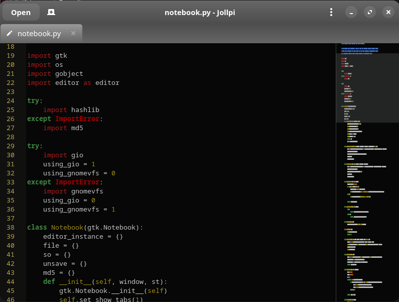

# Jollpi

> The source code is hosted here on [GitLab](https://gitlab.com/zulfian1732/jollpi-text-editor).      

**Jollpi** is a lightweight, simple, and reliable text editor, built with **Python 3**, **GTK4**, and **GtkSourceView 5**. This version is a modern rewrite of the original 2010 Python 2 + PyGTK Jollpi text editor - now refreshed for modern Linux distributions.

---

## 🚀 Version
**3.0**     
For detailed changes, see the [CHANGELOG](CHANGELOG.md).

  
*Jollpi running natively via `install.sh` on GNOME, following system theme.*

  
*Jollpi running via Flatpak, using generic GTK4 theme.*

> Native installation adapts to your desktop theme, while Flatpak uses a bundled GTK4 theme. Flathub installation instructions will be provided once available.

---

## ✨ Features

- Clean and modern GTK4 interface.
- Syntax highlighting via GtkSourceView 5.
- Multi-tab text editing.
- Async operations on file opening.
- Mini map via GtkSourceMap.
- Real-time file monitoring.
- Find & Replace, Go to Line, and quick navigation.
- Auto-indent, auto bracket, line numbering, and line marks.
- Wrap mode and theme switching
- Font customization.
- Printing support.
- Accessible via command line:
  - Native installation: `jollpi`
  - Flatpak: `flatpak run io.gitlab.zulfian1732.jollpi`
- Can also be launched from the application menu or by right-clicking a file in the file manager.
    
---

## 📦 Requirements

Jollpi requires the following:
    
### **Python**
- Python **3.10 – 3.14** is supported

### **Python Modules**
- PyGObject (`gi`)

### **System Libraries**
- **GTK 4** (>= 4.10)
- **GtkSourceView 5**
- **GObject Introspection**
- **Evince** (optional, for PDF viewing)

---

## 📦 Installation

There are two ways to install Jollpi on Linux:
  
### 1. Native installation (via `install.sh`)
This method installs Jollpi directly on your system, and the editor will follow your desktop environment's theme (e.g., GNOME, KDE).
     
```bash
git clone https://gitlab.com/zulfian1732/jollpi-text-editor.git
cd jollpi-text-editor
chmod +x install.sh
./install.sh
```

### 2. Flatpak installation (from source)
This method runs Jollpi in a Flatpak sandbox. The appearance uses a generic GTK4 theme, so colors may look slightly different from your system theme.

```bash
git clone https://gitlab.com/zulfian1732/jollpi-text-editor.git
cd jollpi-text-editor
flatpak-builder --install --user build-dir io.gitlab.zulfian1732.jollpi.json
```

> ⚠️ Once Jollpi is available on Flathub, the Flatpak installation instructions will be updated to use the official Flathub repository instead of building from source.

---

## 👨‍💻 Author

Zulfian

If you find **Jollpi** useful and want to support future updates, you can make a small contribution here:
[**Send support via Ko-fi**](https://ko-fi.com/zulfian1732)

Your support helps keep the project maintained and compatible with modern Linux environments. ❤️

---

## 📄 License
See [LICENSE](LICENSE)

